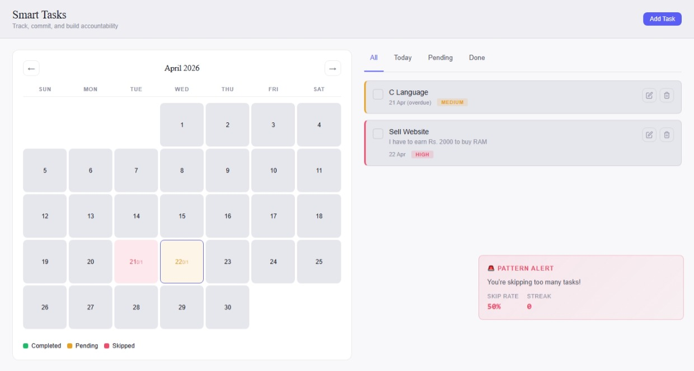

# Smart Task

[](LICENSE)
[]()
[]()

Smart Task is a modern productivity app that combines a clean calendar view with powerful task management. It tracks deadlines, streaks, and skip rates, while subtle animations add delight. Lightweight, responsive, and scalable, it’s built for accountability and growth.

---

## ✨ Features
- 📅 Calendar view with task counts
- ✅ Task creation, editing, and deletion
- 🔥 Streak & skip rate tracking via Enforcement Panel
- 🎯 Priority levels and commitments
- 💾 Local storage persistence

---

## 🚀 Getting Started

### Installation
Clone the repository:
```bash
git clone https://github.com/code-devkmd/Smart-Task.git
cd smart-task
npm install
npm run dev
```

📸 Screenshots


📄 License
This project is licensed under the MIT License.